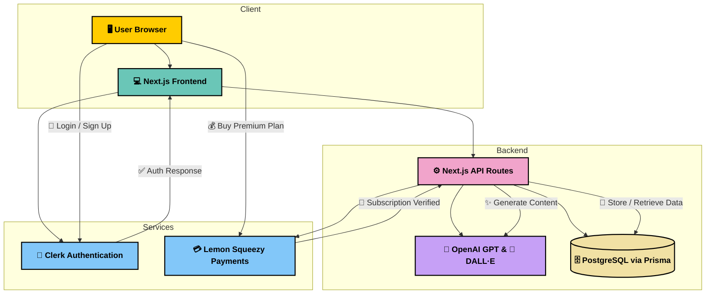

# 🚀 Kraton - AI PPT Builder


---

## 📖 About The Project

**Kraton - AI PPT Builder** is a next-gen SaaS tool that helps you create beautiful, professional presentations in just **one click**. Using **AI (OpenAI GPT + DALL·E)**, Kraton generates slide outlines, themes, layouts, and visuals while allowing full customization with an intuitive **drag-and-drop editor**.

This project was built with **Next.js, Clerk, Prisma, and Lemon Squeezy** to ensure scalability, secure authentication, and monetization.

---

## ✨ Key Features

- 🔑 **Clerk Authentication** – Secure login and signup.
- 🧠 **AI Outline Generator** – Turn prompts into structured slides.
- 🎨 **Themes & Layouts** – Choose from prebuilt or AI-generated themes.
- 🖼 **AI-Powered Images** – Generate visuals using **DALL·E**.
- 🖱 **Drag-and-Drop Editor** – Fully customizable.
- 💾 **Save & Manage Projects** – Keep all your presentations in one place.
- 💳 **Monetization** – Integrated with **Lemon Squeezy**.

---

## 📸 Screenshots

### Landing Page


### Dashboard


### Project Creation


### Theme Generator


### Prompt Management


### Settings (API Integration)


### Recycle Bin


### Slides Edits


### Slide Show


---

## 📁 Directory Structure

The project is organized as follows:

```
Directory structure:
└── ai-ppt-builder/
    ├── README.md
    ├── components.json
    ├── eslint.config.mjs
    ├── LICENSE
    ├── next.config.ts
    ├── package.json
    ├── postcss.config.mjs
    ├── tsconfig.json
    ├── .env.samples
    ├── .prettierignore
    ├── .prettierrc.json
    ├── prisma/
    │   └── schema.prisma
    ├── public/
    │   └── slide.webp
    └── src/
        ├── middleware.ts
        ├── actions/
        │   ├── chatGPT.ts
        │   ├── lemonSqueezy.ts
        │   ├── openAI.ts
        │   ├── projects.ts
        │   └── user.ts
        ├── app/
        │   ├── globals.css
        │   ├── layout.tsx
        │   ├── page.tsx
        │   ├── (auth)/
        │   │   ├── layout.tsx
        │   │   ├── callback/
        │   │   │   ├── loading.tsx
        │   │   │   └── page.tsx
        │   │   ├── sign-in/
        │   │   │   └── [[...sign-in]]/
        │   │   │       └── page.tsx
        │   │   └── sign-up/
        │   │       └── [[...sign-up]]/
        │   │           └── page.tsx
        │   ├── (protected)/
        │   │   ├── layout.tsx
        │   │   ├── (pages)/
        │   │   │   ├── layout.tsx
        │   │   │   └── (dashboardPages)/
        │   │   │       ├── create-page/
        │   │   │       │   ├── page.tsx
        │   │   │       │   └── _components/
        │   │   │       │       ├── renderPage.tsx
        │   │   │       │       ├── common/
        │   │   │       │       │   ├── addCardButton.tsx
        │   │   │       │       │   ├── card.tsx
        │   │   │       │       │   └── cardList.tsx
        │   │   │       │       ├── create-page/
        │   │   │       │       │   ├── createPage.tsx
        │   │   │       │       │   └── createPageSkeleton.tsx
        │   │   │       │       ├── generate-ai/
        │   │   │       │       │   ├── creativeAI.tsx
        │   │   │       │       │   └── recentPrompts.tsx
        │   │   │       │       └── scratch/
        │   │   │       │           └── scratchPage.tsx
        │   │   │       ├── dashboard/
        │   │   │       │   └── page.tsx
        │   │   │       ├── settings/
        │   │   │       │   ├── page.tsx
        │   │   │       │   └── _components/
        │   │   │       │       └── userSettings.tsx
        │   │   │       ├── share/
        │   │   │       │   └── [shareID]/
        │   │   │       │       └── page.tsx
        │   │   │       ├── templates/
        │   │   │       │   ├── page.tsx
        │   │   │       │   └── [templates]/
        │   │   │       │       └── page.tsx
        │   │   │       └── trash/
        │   │   │           ├── page.tsx
        │   │   │           └── _components/
        │   │   │               └── deleteAllButton.tsx
        │   │   └── presentation/
        │   │       ├── layout.tsx
        │   │       ├── page.tsx
        │   │       └── [presentationID]/
        │   │           ├── page.tsx
        │   │           ├── _components/
        │   │           │   ├── editor/
        │   │           │   │   ├── dropZone.tsx
        │   │           │   │   ├── editor.tsx
        │   │           │   │   └── masterRecursiveComponent.tsx
        │   │           │   ├── editor-sidebar/
        │   │           │   │   ├── left-sidebar/
        │   │           │   │   │   ├── dragableSlidePreview.tsx
        │   │           │   │   │   ├── layoutPreview.tsx
        │   │           │   │   │   └── scaledPreview.tsx
        │   │           │   │   └── right-sidebar/
        │   │           │   │       ├── index.tsx
        │   │           │   │       └── tabs/
        │   │           │   │           ├── layoutChooser.tsx
        │   │           │   │           ├── themeChooser.tsx
        │   │           │   │           └── components-tabs/
        │   │           │   │               ├── componentPreview.tsx
        │   │           │   │               └── layoutPreviewItem.tsx
        │   │           │   └── navbar/
        │   │           │       ├── navbar.tsx
        │   │           │       └── presentationMode.tsx
        │   │           └── select-theme/
        │   │               ├── page.tsx
        │   │               └── _components/
        │   │                   ├── themeCard.tsx
        │   │                   ├── themePicker.tsx
        │   │                   └── themePreview.tsx
        │   └── api/
        │       └── webhook/
        │           └── subscriptions/
        │               └── route.ts
        ├── components/
        │   ├── global/
        │   │   ├── alert-dialog/
        │   │   │   └── index.tsx
        │   │   ├── app-sidebar/
        │   │   │   ├── index.tsx
        │   │   │   ├── navFooter.tsx
        │   │   │   ├── navMain.tsx
        │   │   │   └── recentOpen.tsx
        │   │   ├── editor/
        │   │   │   └── components/
        │   │   │       ├── blockQuote.tsx
        │   │   │       ├── calloutBox.tsx
        │   │   │       ├── codeBlock.tsx
        │   │   │       ├── columnComponent.tsx
        │   │   │       ├── divider.tsx
        │   │   │       ├── headings.tsx
        │   │   │       ├── imageComponent.tsx
        │   │   │       ├── listComponent.tsx
        │   │   │       ├── paragraph.tsx
        │   │   │       ├── tableComponet.tsx
        │   │   │       ├── tableOfContents.tsx
        │   │   │       └── uploadImage.tsx
        │   │   ├── mode-toggle/
        │   │   │   └── index.tsx
        │   │   ├── not-found/
        │   │   │   └── index.tsx
        │   │   ├── project-card/
        │   │   │   ├── index.tsx
        │   │   │   └── thumbnailPreview.tsx
        │   │   ├── projects/
        │   │   │   └── index.tsx
        │   │   └── upper-infobar/
        │   │       ├── index.tsx
        │   │       ├── newProjectButton.tsx
        │   │       ├── sellButton.tsx
        │   │       └── upperInfoSearchBar.tsx
        │   └── ui/
        │       ├── accordion.tsx
        │       ├── alert-dialog.tsx
        │       ├── alert.tsx
        │       ├── aspect-ratio.tsx
        │       ├── avatar.tsx
        │       ├── badge.tsx
        │       ├── breadcrumb.tsx
        │       ├── button.tsx
        │       ├── calendar.tsx
        │       ├── card.tsx
        │       ├── carousel.tsx
        │       ├── chart.tsx
        │       ├── checkbox.tsx
        │       ├── collapsible.tsx
        │       ├── command.tsx
        │       ├── context-menu.tsx
        │       ├── dialog.tsx
        │       ├── drawer.tsx
        │       ├── dropdown-menu.tsx
        │       ├── form.tsx
        │       ├── hover-card.tsx
        │       ├── input-otp.tsx
        │       ├── input.tsx
        │       ├── label.tsx
        │       ├── menubar.tsx
        │       ├── navigation-menu.tsx
        │       ├── pagination.tsx
        │       ├── popover.tsx
        │       ├── progress.tsx
        │       ├── radio-group.tsx
        │       ├── resizable.tsx
        │       ├── scroll-area.tsx
        │       ├── select.tsx
        │       ├── separator.tsx
        │       ├── sheet.tsx
        │       ├── sidebar.tsx
        │       ├── skeleton.tsx
        │       ├── slider.tsx
        │       ├── sonner.tsx
        │       ├── switch.tsx
        │       ├── table.tsx
        │       ├── tabs.tsx
        │       ├── textarea.tsx
        │       ├── toggle-group.tsx
        │       ├── toggle.tsx
        │       └── tooltip.tsx
        ├── hooks/
        │   └── use-mobile.ts
        ├── lib/
        │   ├── axios.ts
        │   ├── constant.ts
        │   ├── IconsComponent.tsx
        │   ├── prisma.ts
        │   ├── slideComponents.ts
        │   ├── slideLayouts.ts
        │   ├── types.ts
        │   └── utils.ts
        ├── provider/
        │   └── theme-provider.tsx
        └── store/
            ├── useCreativeAIStore.tsx
            ├── usePromptStore.tsx
            ├── useSlideStore.tsx
            └── useStartScratchStore.tsx
```

### Key Folders and Files:

- **/components**: Contains reusable.
- **/pages**: Includes the main routes for pages like login, createve page, and ppt pages.
- **/api**: Server-side route handlers for database interactions and ppt creation.
- **/prisma**: Prisma schema and client for database interaction.
- **/styles**: TailwindCSS styles and global styling.

---

## 🏗️ Architecture

The system architecture is built to balance **performance, scalability, and modularity**. It follows a **client-server model** with clear responsibilities:

- **Frontend (Next.js + TailwindCSS + ShadCN UI):** Renders the dashboard, editor, and presentation views. Handles client-side logic and state with **Zustand**.
- **Backend (Next.js API Routes):** Handles slide generation requests, image creation, and data persistence.
- **AI Integration (OpenAI GPT + DALL·E):** Powers content generation (outlines, text, images).
- **Database (Prisma + PostgreSQL):** Stores user accounts, projects, slides, and history.
- **Authentication (Clerk):** Provides secure user login and session management.
- **Payments (Lemon Squeezy):** Handles subscriptions and monetization for premium features.



---

## 🛠 Built With

- **Frontend:** Next.js 15, TypeScript, TailwindCSS, ShadCN UI
- **Backend:** Prisma ORM, PostgreSQL
- **AI:** OpenAI GPT + DALL·E
- **Auth:** Clerk
- **Payments:** Lemon Squeezy
- **State Management:** Zustand

---

## ⚙️ Getting Started

### Prerequisites

- Node.js 18+
- PostgreSQL instance
- OpenAI API Key
- Clerk API Key
- Lemon Squeezy API Key

### Installation

```bash
git clone https://github.com/username/ai-ppt-builder.git
cd ai-ppt-builder
npm install
```

### Configuration

Rename `.env.example` to `.env.local` and update:

```env
DATABASE_URL=your_postgres_url
OPENAI_API_KEY=your_openai_key
CLERK_SECRET_KEY=your_clerk_secret
LEMON_SQUEEZY_API_KEY=your_api_key
```

### Database Setup (Prisma)

1. Install Prisma CLI:

```bash
npm install prisma --save-dev
```

2. Initialize Prisma:

```bash
npx prisma init
```

3. Generate Prisma client:

```bash
npx prisma generate
```

4. Push database schema to PostgreSQL:

```bash
npx prisma db push
```

5. (Optional) Open Prisma Studio to explore/manage DB:

```bash
npx prisma studio
```

### Run

```bash
npm run dev
```

Visit [http://localhost:3000](http://localhost:3000)

---

## 🛣️ Roadmap

- [x] AI Slide Generator
- [x] AI Themes & Images
- [x] Clerk Authentication
- [x] Lemon Squeezy Integration
- [ ] Team Collaboration
- [ ] Export as PPTX/PDF
- [ ] Cloud Deployment (Vercel/AWS)

---

## 📜 License

MIT License © 2025 Aryan Baadlas

---

## 📬 Contact

👨‍💻 **karan**  
📧 **karansodhi703@gmail.com**

---

### ⭐ Show some love!

If you like this project, **give it a star ⭐ on GitHub**!
